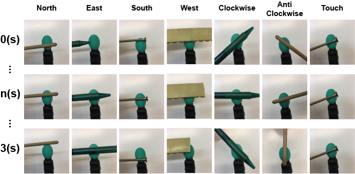
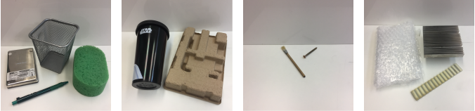

# BioTacSP-DoS

This repository contains a dataset created for the task of direction of slip (DoS) detection using tactile sensors. In total, 7 directions or types of slippage were recorded: slip north, slip east, slip south, slip west, slip clockwise, slip anti-clockwise and touch (stable contact). In order to generate this dataset, we performed each of the movements on one BioTac SP sensor using different objects. The procedure followed to record a sequence of data for each category is shown below. We maintained different velocities and produced different forces in order to increase the variability of the recorded sequences. Each recorded sequence held a movement of only one of the categories, which was acquired by saving the values of the electrodes for 3s. Since the sensor publishes its data with a peak frequency of 100Hz, we had approximately 300 consecutive tactile readings for each of the 24 electrodes inside the sensor from each sequence.



Following this methodology, we recorded 4 datasets containing different objects and textures. The *Basic* object set comprises 4 objects: a metal pen case, a hard drive, a sponge and a plastic pen. The *Solids* set comprises 2 objects: a plastic bottle and a piece of cardboard. The *Small* set consists of 2 objects: a wooden brush and a metal screw. Finally, the *Textures* set comprises 3 objects: a striped piece of plastic, a piece of bubble wrap and a striped plate (heat sink). These object sets are displayed below:



For each direction of slip, we recorded 4 sequences for every object in order to keep the datasets balanced. Table below provides further information about the datasets:

| Object Set | Items | Sequences/Class | Total Sequences | Total Tactile Readings |
|:---|:---:|:---:|:---:|:---:|
| *Basic* | 4 | 4 | 112 | 30673 |
| *Solids* | 2 | 4 | 56 | 15492 |
| *Small* | 2 | 4 | 56 | 15520 |
| *Textures* | 3 | 4 | 84 | 22662 |

The dataset is stored under the *csvs* folder where there is a sub-folder for each class:
- 'n' stands for *north* (translational slip)
- 'e' stands for *east* (translational slip)
- 's' stands for *south* (translational slip)
- 'w' stands for *west* (translational slip)
- 'cw' stands for *clockwise* (rotational slip)
- 'aw' stands for *anti-clockwise* (rotational slip)
- 't' stands for *touch* (stable contact)

Under each sub-folder, there is a CSV file containing a whole recording session or sequence for a single object: bottle (plastic bottle, *Solids* set), brush (wooden brush, *Small* set), bubbles (bubble wrap, *Textures* set), cardboard (cardboard, *Solids* set), case (metal pen case, *Basic* set), hd (hard drive, *Basic* set), pen (plastic pen, *Basic* pen), plate (metal heat sink, *Textures* set), screw (metal scree, *Small* set), sponge (sponge, *Basic* set) and striped (striped piece of plastic, *Textures* set). Each row of CSV file contains the 24 electrodes values of the BioTac SP sensor used in this work.

# Citation
```
@article{BTS-DOS,
  author = {Zapata-impata, Brayan S. and Gil, Pablo and Torres, Fernando},
  doi = {10.3390/s19030523},
  journal = {Sensors},
  number = {3},
  pages = {1--16},
  title = {{Learning Spatio Temporal Tactile Features with a ConvLSTM for the Direction Of Slip Detection}},
  url = {https://www.mdpi.com/1424-8220/19/3/523},
  volume = {19},
  year = {2019}
}
```
